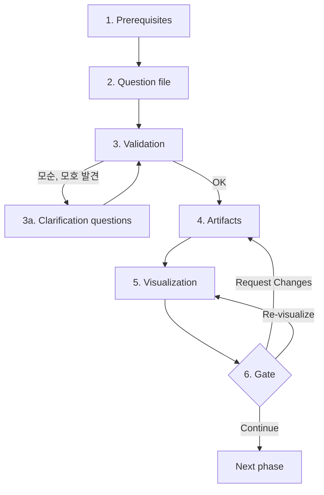
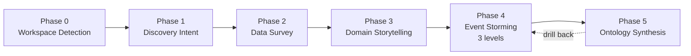

# Process Overview

워크숍은 6개 단계로 진행한다. 각 단계에서 자료 확인, 질문, 답변 검토, 결과 작성, 시각화, 사용자 확인을 순서대로 수행한다.

## 6-Step Phase Pattern



### Step 1: Prerequisites
이전 phase 산출물 + ontology-state.md 확인. 누락 시 사용자 안내 후 종료. Phase 0은 prerequisite 없음.

### Step 2: Question file
`{workspace}/ontology-docs/{NN-phase}/{phase}-questions.md`를 작성. `[Answer]:` 태그 양식. 사용자에게 파일 위치와 응답 방법 안내. **호스트 에이전트는 사용자가 "done"/"completed"/"끝" 등으로 알리기 전까지 다음 동작 금지.**

### Step 3: Validation
사용자 응답 수신 후 파일 재읽기 → 답변 추출 → 모순, 모호 검증.
- 응답이 `[Answer]:` 태그 뒤에 없으면 사용자 안내.
- 옵션 A~E 외 텍스트(예: "둘 다", "잘 모르겠음")는 명확화 질문 파일 추가.
- 응답들 간 모순(예: 깊이=Comprehensive + 시한=1주) 발견 시 `{phase}-clarification-questions.md` 작성, 다시 Step 2로.

### Step 4: Artifacts
phase별 산출물 작성. 모든 마크다운 파일은 frontmatter 없이 헤더부터 시작. JSON 산출물(`viz/*.json`)은 Cytoscape 호환 스키마(`visualization-protocol.md` 참조). 자동 추출 결과는 모두 "candidate" 표시(`overconfidence-prevention.md`).

### Step 5: Visualization
산출물 작성 직후 `viz-server/server.py`를 백그라운드로 시작(또는 살아있는 PID 재사용). `viz-runtime/current.json`을 phase 산출물에서 통합 생성. 브라우저 자동 열기. 상세는 `visualization-protocol.md`.

### Step 6: Gate
표준 메시지로 사용자 응답 요청. 응답을 audit.md에 원문 기록. ontology-state.md의 `current_phase`, `current_step`, `next_immediate_action` 갱신. 응답에 따라 분기.

---

## Phase Sequence (데이터 흐름)



각 phase 산출물은 다음 phase의 입력이 된다:
- **Phase 0 → 1**: `brownfield: bool`, `detected_sources`
- **Phase 1 → 2**: discovery-intent (depth, scope), personas-seed
- **Phase 2 → 3**: candidate-inventory (사실 기반 엔티티 목록)
- **Phase 3 → 4**: stories, personas, glossary (시나리오 기반 명사, 동사)
- **Phase 4 → 5**: events, commands, aggregates, bounded-contexts
- **Phase 5**: 통합 ontology + crosswalk (Phase 2 raw schemas 매핑)

---

## Trace Link Chain

```
Story (Phase 3)
  └── Activity / Work Object
        └── Domain Event (Phase 4)
              └── Aggregate
                    └── Entity (Phase 5)
                          └── Relationship
```

모든 노드는 `trace_links: [...]` 필드로 출처를 명시(상세: `trace-link.md`).

---

## State Transitions

`ontology-state.md`의 `current_step`은 다음 중 하나:

- `starting`: phase 진입, prerequisites 확인 중
- `gathering`: question file 작성 중
- `awaiting-answers`: 사용자 응답 대기 중
- `validating`: 응답 검증 중 (모순 시 명확화 질문 추가)
- `producing-artifacts`: 산출물 작성 중
- `rendering-viz`: viz-server 실행/갱신 중
- `awaiting-gate`: 사용자 게이트 응답 대기 중

각 상태 전환 시 `next_immediate_action`도 함께 갱신해야 compact 후 저장한 상태에서 재개된다.
