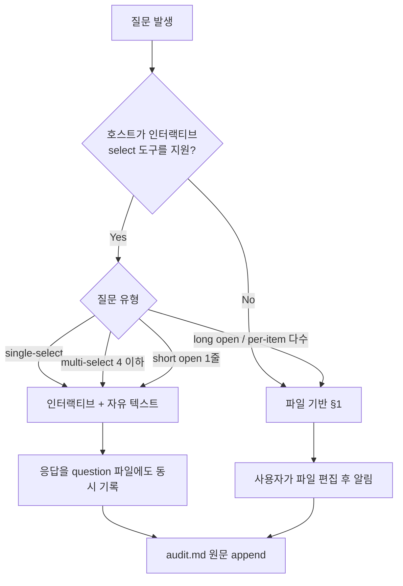

# Question Format Guide

질문과 응답은 질문 파일과 `audit.md`에 기록한다. 입력 방식은 질문 길이와 사용 중인 AI 도구에 맞춘다.

입력 방식은 다음 기준으로 선택한다.
1. 호스트 에이전트가 인터랙티브 select 도구를 가지면 그것을 우선 사용한다(예: Claude Code `AskUserQuestion`).
2. 그렇지 않거나 자유 서술이 필요한 질문은 파일 기반으로 묻는다.
3. 채팅에서 받은 응답도 질문 파일과 `audit.md`에 기록한다.

---

## 0. 입력 방식 선택 (Decision Tree)



### 어떤 호스트가 인터랙티브를 지원하나
- **Claude Code**: `AskUserQuestion` 도구. **지원**.
- **Kiro CLI**: 일반 채팅만. **미지원** → 파일 기반.
- **Codex / GitHub Copilot CLI**: 텍스트 채팅만. **미지원** → 파일 기반.

호스트 에이전트는 자기가 어느 환경에 있는지 알기 어려울 수 있다. 다음 규칙으로 판단:
- 호스트가 명시적으로 인터랙티브 도구를 노출하면 사용.
- 모르겠으면 파일 기반(안전한 기본값).

### 0.1 인터랙티브 모드

**적합한 질문 유형:**
- single-select (A/B/C/D 중 하나)
- multi-select 4 옵션 이하
- 짧은 자유 텍스트 1줄 (도메인 영역 한 줄 요약 등)

**적합하지 않은 질문 유형 → 파일 기반:**
- 시나리오 자유 서술 같은 long-form text
- 한 질문에 sub-item이 5개 이상 (per-item 신뢰도 평가 등)
- 사용자가 자기 페이스로 답해야 하는 그룹 질문

**인터랙티브 동작:**
1. select UI로 질문 → 사용자 응답 받음.
2. 응답을 즉시 `{workspace}/ontology-docs/{NN-phase}/{phase}-questions.md` 파일의 해당 `[Answer]:` 줄에 기록 (파일이 없으면 생성).
3. audit.md에 원문 append.
4. 자기 페이스를 위해 한 phase의 모든 질문을 한 번에 묻지 말고, 자연스러운 그룹으로 나누어 진행.

### 0.2 파일 기반 모드

§1~§7 본문을 그대로 따른다. 채팅 question 금지, `[Answer]:` 태그, "done" 알림 후 파싱.

### 0.3 동일 phase 안에서 혼합

한 phase 안에서 일부 질문은 인터랙티브, 일부는 파일로도 가능. 예: Phase 1
- Q1 (도메인 한 줄): 인터랙티브 텍스트
- Q2 (목적 multi-select): 인터랙티브 select
- Q3 (깊이 single-select): 인터랙티브 select
- Q4 (페르소나 자유 서술 여러 줄): 파일
- Q5 (in-scope 자유 서술): 파일
- Q6 (out-of-scope 자유 서술): 파일
- Q7 (시한 single-select): 인터랙티브 select

**중요:** Q1, Q2, Q3, Q7을 인터랙티브로 받았더라도 같은 question 파일에 기록되어야 한다. 사용자가 Q4, Q5, Q6 답변하러 파일을 열었을 때 이미 Q1, Q2, Q3, Q7이 채워져 있는 모습이 보여야 함.

---

## 1. 질문 파일 위치

```
{workspace}/ontology-docs/{NN-phase}/{phase}-questions.md
```

예:
- `01-intent/intent-questions.md`
- `02-data-survey/data-sources-questions.md`
- `03-storytelling/storytelling-questions.md`
- `04-eventstorming/eventstorming-questions.md`
- `05-ontology/ontology-questions.md`

명확화 질문은 `{phase}-clarification-questions.md`로 별도 작성.

---

## 2. 질문 구조

```markdown
# {Phase Name} Questions

> 답변 방법: 각 질문 아래 `[Answer]:` 줄에 선택한 옵션 글자(A, B, C, D, E)를 입력하거나, "Other"인 경우 자유 텍스트로 작성. 모두 작성한 뒤 채팅에 "done" 또는 "끝"이라고 알려주세요.

## Question 1
도메인 영역은 무엇입니까?

(자유 서술)

[Answer]:


## Question 2
온톨로지의 1차 사용 목적은? (복수 선택 가능, 콤마로 구분)

A. LLM RAG (검색 증강 생성)
B. 그래프 DB 적재 (Neo4j, Neptune 등)
C. 검색, 추천 시스템
D. 문서, 스키마 정렬, 표준화
E. 시스템 설계, 도메인 모델링
F. Other (please describe after [Answer]: tag below)

[Answer]:


## Question 3
깊이는?

A. Minimal: 핵심 엔티티, 관계만 (빠른 PoC용)
B. Standard: 권장. 페르소나, 이벤트, 애그리거트까지
C. Comprehensive: 모든 컨텍스트, 정책, 읽기모델, crosswalk 포함
D. Other (please describe after [Answer]: tag below)

[Answer]:
```

---

## 3. 옵션 작성 규칙

### 3.1 옵션 수
- **최소**: 의미 있는 선택지 2개 + Other
- **권장**: 3~4개 + Other
- **최대**: 5개 + Other

옵션을 채우려고 의미 없는 선택지를 만들지 말 것. 진짜 선택지가 2개면 2개로.

### 3.2 "Other" 옵션 의무
모든 선택형 질문의 **마지막 옵션은 반드시** 다음 형식:

```
{글자}. Other (please describe after [Answer]: tag below)
```

이유: 사용자가 옵션에 없는 답을 줘야 할 때 이 워크플로우가 막히지 않게.

### 3.3 옵션 품질
- **상호 배타**: 같은 답 두 옵션에 들어가지 않게
- **현실적**: 실제 도메인에서 일어나는 선택만
- **구체적**: "기타", "복합" 같은 모호 옵션 금지(Other가 그 역할)
- **흔한 시나리오 우선**: 가장 자주 일어나는 답이 A에 가깝게

---

## 4. 질문 유형

### 4.1 Single-select
A~E 중 하나. 사용자는 한 글자만 입력.

```
[Answer]: B
```

### 4.2 Multi-select
복수 선택. 사용자는 콤마로 구분.

```
[Answer]: A, C, E
```

### 4.3 Open
자유 서술. 옵션 없음, `[Answer]:` 줄 아래에 자유 텍스트.

```
[Answer]:
결제대행사(PG)와 가맹점주 사이의 일일 정산 프로세스.
주요 페르소나는 PG 운영팀, 가맹점주, 그리고 회계팀.
```

### 4.4 Per-item
한 질문에 여러 항목별 답이 필요한 경우(예: "각 자료원의 신뢰도?"). 항목별로 sub-question을 둔다.

```markdown
## Question 5
각 자료원의 신뢰도?

### 5.1 openapi.yaml
A. 최신
B. 약간 오래됨
C. 부정확함 알려진 곳 있음
D. Other (please describe after [Answer]: tag below)

[Answer]:

### 5.2 db_schema.sql
A. 최신
B. 약간 오래됨
C. 부정확함 알려진 곳 있음
D. Other (please describe after [Answer]: tag below)

[Answer]:
```

---

## 5. 응답 처리 워크플로우

### 5.1 사용자 알림 메시지

**파일 기반 질문이 있는 경우:**
```
질문 파일을 작성했습니다: {file path}
- 인터랙티브로 답한 항목: Q1, Q2, Q3, Q7 (이미 파일에 반영됨)
- 사용자가 파일에서 답할 항목: Q4, Q5, Q6

파일을 열어 [Answer]: 줄에 답변을 작성하신 뒤
"done" 또는 "끝"이라고 알려주세요.
```

**모든 질문이 인터랙티브로 끝난 경우:**
별도 알림 메시지 없이 다음 step(§5.3 검증)으로 바로 진행. 이때도 `{phase}-questions.md`는 응답이 채워진 상태로 저장되어 있어 audit, 재개, trace에 사용된다.

### 5.2 사용자 응답 대기

**파일 기반 질문이 남아있는 경우:**
사용자가 "done"/"끝"/"completed"/"finished" 등으로 알리기 전까지 다음 동작 금지. ontology-state.md의 `current_step: awaiting-answers`로 갱신, `awaiting_input_file`도 기록.

**인터랙티브 only인 경우:**
`current_step`은 `awaiting-answers` 대신 `validating`으로 직행. `awaiting_input_file`은 빈 문자열.

### 5.3 응답 추출 및 검증
사용자 알림 후(또는 인터랙티브 응답 직후):

1. 질문 파일 재읽기 (인터랙티브 응답도 거기 기록되어 있어야 함).
2. 각 `[Answer]:` 태그 뒤의 텍스트 추출.
3. 빈 응답 → 사용자에게 어떤 질문이 비었는지 알리고 추가 작성 요청.
4. 옵션 글자(A, B, ...) 형식이 아닌데 single-select 질문이면 → 명확화 요청 (예: "Q3에 'B 정도'라고 적으셨는데, B로 해석할까요?"). 인터랙티브 모드라면 select UI로 재확인.
5. 모순 검출(아래 §6) → 명확화 질문 파일 또는 인터랙티브 명확화 질문.

### 5.4 응답 기록 (입력 방식 무관)
모든 응답은 다음 두 곳에 동일하게 보존:
- **`{phase}-questions.md`**: 해당 `[Answer]:` 줄에 기록.
- **`audit.md`**: 원문 그대로 append. 형식은 `session-continuity.md`.

이 이중 기록이 입력 방식 차이를 흡수한다: 인터랙티브로 받았든 파일로 받았든, 재개 시, 검증 시, 다음 phase에서 차이가 없다.

---

## 6. 모순, 모호 검증 (의무)

응답 검증 시 다음을 확인:

### 6.1 Cross-question 모순
같은 phase 내 답들이 충돌하는가?
- 깊이=Comprehensive + 시한=1주 → 모순
- Out-of-scope에 "환불"인데 In-scope 시나리오에 환불 등장 → 모순
- 페르소나에 "관리자"만 있는데 시나리오에 "고객"이 등장 → 누락

### 6.2 Cross-phase 모순
이전 phase 산출물과 충돌하는가?
- Phase 1 scope에서 "B2B만"인데 Phase 3 시나리오에 B2C 등장 → 모순
- Phase 2 candidate-inventory에 `Settlement` 엔티티가 있는데 Phase 3 stories에 settlement 개념이 없으면 → "이 엔티티 사용 안 하시나요?" 확인.

### 6.3 모호성
- "둘 다", "복합", "복잡함" 같은 답
- 옵션에 없는 답인데 Other가 아니라 빈 칸
- 자유 서술 답이 너무 짧아 의미 추출 불가

### 6.4 명확화 질문 파일

발견 시 `{phase}-clarification-questions.md` 작성:

```markdown
# {Phase Name}: Clarification Questions

다음 응답에 모순/모호한 점이 있어 추가 질문드립니다.

## Question C1 (참조: Q3, Q7)
Q3에서 깊이 = Comprehensive를 선택하셨는데, Q7에서 시한 = 1주를 선택하셨습니다.
Comprehensive 깊이는 보통 4~6주가 필요합니다.

A. 깊이를 Standard로 변경 (1주 가능)
B. 시한을 1개월로 연장 (Comprehensive 유지)
C. Comprehensive를 핵심 컨텍스트 1개에만 적용, 나머지는 Standard
D. Other (please describe after [Answer]: tag below)

[Answer]:
```

명확화 답변 후 다시 §5.3 검증. 해결될 때까지 다음 step 진입 금지.

---

## 7. Do / Don't

확인: Do
- 호스트가 인터랙티브 select 도구를 가지면 single, multi-select 질문은 그것 사용
- 인터랙티브로 받은 응답도 `{phase}-questions.md`에 동시 기록
- 모든 선택형 질문 마지막에 Other 옵션
- `[Answer]:` 태그를 모든 응답 위치에 사용
- 자유 서술, long-form은 파일 기반 유지
- 모순, 모호 검증을 입력 방식 무관하게 적용
- 응답을 audit.md에 원문 보존

금지: Don't
- 인터랙티브 도구가 있다고 long-form 자유 서술까지 select로 강요하지 말 것
- 인터랙티브 응답을 파일, audit에 기록하지 않은 채 다음 step 진행하지 말 것
- 채팅에 직접 질문 적기(인터랙티브가 아닌 일반 대화 질문): 인터랙티브든 파일이든 둘 중 하나
- 의미 없는 옵션을 채우지 말 것
- 옵션을 5개 + Other 초과해서 만들지 말 것
- 사용자가 답하기 전에 다음 작업 시작하지 말 것
- 모순을 묵인하고 진행하지 말 것
