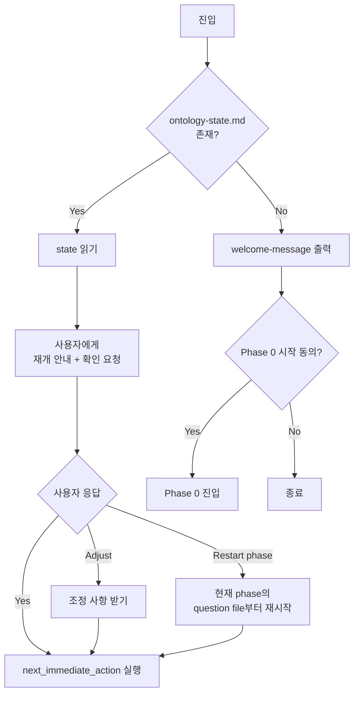

# Session Continuity (Resume Protocol)

세션이 바뀌거나 대화가 압축되면 `ontology-state.md`와 `audit.md`를 읽는다. 현재 단계와 다음 작업을 사용자에게 확인한 뒤 이어서 진행한다.

---

## 1. 진입점 첫 액션 (강제 규칙)

명령, 스킬, 자연어 요청으로 워크숍에 진입하면 다른 작업보다 먼저 다음 절차를 수행한다.



### 1.1 재개 안내 메시지 형식

```
ontology-discovery 워크플로우 재개

Phase: {current_phase} / Step: {current_step}
마지막 동작: {last_user_action_iso}
다음 액션: {next_immediate_action}

{만약 unanswered_questions가 비어있지 않으면:}
미응답 질문: {unanswered_questions} (in {awaiting_input_file})

진행할까요?
1. Yes: 위 액션 그대로 실행
2. Adjust: 조정 사항 알려주기
3. Restart phase: 현재 phase의 question file부터 다시
```

### 1.2 사용자 응답 전 금지

호스트 에이전트는 **사용자 응답 전에 절대 다음 작업을 시작하지 않는다.** 새로운 컨텍스트라 정보가 부족해 보여도, 부족한 상태에서의 행동보다 사용자 확인이 안전하다.

---

## 2. ontology-state.md 풀 스키마

**파일 형식: 순수 YAML (확장자가 .md여도 본문은 YAML이다).**

- 마크다운 헤더(`#`, `##`)나 ` ```yaml ` fence 코드블록 사용 **금지**.
- 한 단계 주석(`#`)으로 섹션 구분.
- 파일 전체를 한 번에 다시 쓴다(부분 patch 금지).
- `yaml.safe_load(open('ontology-state.md').read())`로 곧바로 파싱 가능해야 함.

**아래 블록은 파일에 들어갈 정확한 본문**(코드블록 마커는 문서 표시용이므로 실제 파일에는 적지 않는다):

```yaml
# === Workflow Position ===
current_phase: 03-storytelling          # 00-workspace-detection | 01-intent | 02-data-survey | 03-storytelling | 04-eventstorming | 05-ontology
current_step: awaiting-answers           # starting | gathering | awaiting-answers | validating | producing-artifacts | rendering-viz | awaiting-gate
awaiting_input_file: ontology-docs/03-storytelling/storytelling-questions.md
unanswered_questions: [Q1, Q4, Q7]
last_gate_response: continue             # 직전 phase의 게이트 응답
last_user_action_iso: 2026-05-26T14:32:11Z
next_immediate_action: |
  Read storytelling-questions.md, validate Q1/Q4/Q7 answers,
  update personas.md and stories/, then launch viz server.

# === Decision Context (the "why") ===
discovery_intent_summary: "결제 정산 도메인 LLM RAG용. 깊이=standard. 범위=B2B 정산만, 환불 제외."
key_decisions:
  - phase: 01
    decision: "depth=standard"
    reason: "사용자가 6주 내 PoC 목표로 standard 선택"
  - phase: 02
    decision: "OpenAPI + Settlement DB 스키마만 스캔, 로그 제외"
    reason: "운영 로그는 PII 우려로 사용자가 제외 결정"

# === Personas (consistent IDs across phases) ===
personas:
  - id: P-merchant
    name: 가맹점주
    role: "정산 대상자"
    introduced_phase: 01-intent
  - id: P-pgops
    name: PG 운영팀
    role: "정산 처리, 이슈 대응"
    introduced_phase: 03-storytelling

# === Visualization Runtime ===
viz_server_pid: 51234
viz_server_url: http://localhost:5176
viz_last_rendered: 2026-05-26T14:30:02Z
viz_data_source: ontology-docs/viz-runtime/current.json
# Health & user confirmation (visualization-protocol.md §7)
viz_health_status: ok          # ok | degraded | unreachable
viz_health_checked_at: 2026-05-26T14:32:00Z
viz_last_render_ok: true
viz_last_render_nodes: 41
viz_user_confirmed: true       # true | false | skipped

# === Configuration ===
brownfield: true
data_sources_scanned:
  - openapi.yaml
  - schemas/ddl.sql
depth: standard                          # minimal | standard | comprehensive
```

### 2.1 갱신 시점

- phase 전환 직후
- step 전환 직후
- 사용자 응답 수신 직후
- viz-server 시작/재시작 직후
- key_decisions가 추가될 때마다

### 2.2 갱신 방법

전체 파일을 다시 쓴다. 부분 patch는 일관성을 깨기 쉬움. 갱신 직전 상태를 audit.md에 기록할 수도 있지만 의무는 아님(필요 시 git history로 복원).

---

## 3. audit.md 형식

append-only. **요약 금지, 원문 보존**.

```markdown
# Ontology Discovery: Audit Log

## Phase 03: Storytelling: Q1 answered
**Time:** 2026-05-26T14:32:11Z
**Stage:** 03-storytelling/awaiting-answers
**User input (raw):**
> 결제는 가맹점주가 시작하지 않고, 결제대행사(PG)가 매일 새벽 2시에 정산 배치를 돌립니다.
> 정산 결과는 가맹점주가 다음날 오전에 확인합니다.

**AI response summary:** Story-001 created with P-pgops as primary actor. P-merchant as observer. Will ask follow-up about exception cases (Q5).
**Context:** Working in stories/story-001-daily-settlement.md
---

## Phase 03: Storytelling: Q4 answered
**Time:** 2026-05-26T14:35:42Z
**Stage:** 03-storytelling/awaiting-answers
**User input (raw):**
> ...
```

### 3.1 항목 종류

- **사용자 답변** (질문 파일 응답)
- **사용자 게이트 응답** (Continue / Request Changes / ...)
- **사용자 자유 발언** (게이트 외)
- **시스템 이벤트** (viz-server 실패, 외부 자료원 접근 실패 등)
- **drill-back / restart** 결정

### 3.2 절대 금지

- 덮어쓰기
- 요약, 축약 (원문 보존)
- 항목 삭제 (잘못 적었으면 정정 항목을 새로 append)

### 3.3 정정 형식

```markdown
## CORRECTION: Phase 03: Q1
**Time:** 2026-05-26T14:40:00Z
**Refers to:** Phase 03: Q1 answered (2026-05-26T14:32:11Z)
**Reason:** 사용자가 PG → "PG사" 호칭 변경 요청.
**Action:** personas.md, stories/story-001 갱신.
---
```

---

## 4. compact 후 동작

### 4.1 compact 직전
호스트 에이전트는 compact 직전임을 알 수 없을 수 있음. 그래서 다음 step 진입할 때마다 state, audit 갱신을 의무로 한다(이미 §2, §3에서 강제).

### 4.2 compact 직후 첫 메시지
사용자의 다음 메시지가 어떤 내용이든, 호스트 에이전트는 §1 첫 액션을 수행. 사용자 메시지가 짧은 답변(예: "그래")이라도 일단 state를 읽고 재개 안내를 보낸 후 응답을 처리.

**예외:** 사용자가 명시적으로 "skip resume" 또는 "재개 확인 건너뛰어"라고 하면 다이렉트 진행 가능. 이 결정은 audit.md에 기록.

---

## 5. SessionStart Hook (선택)

`.claude/settings.json`에 다음 hook을 추가하면 새 세션 시작 시 자동으로 state, audit 일부가 컨텍스트에 주입된다:

```json
{
  "hooks": {
    "SessionStart": [
      {
        "type": "command",
        "command": "if [ -f ./ontology-docs/ontology-state.md ]; then echo '=== ontology-state.md ===' && cat ./ontology-docs/ontology-state.md && echo '=== audit.md (last 50 lines) ===' && tail -n 50 ./ontology-docs/audit.md; fi"
      }
    ]
  }
}
```

`scripts/install.sh`가 이 옵션을 사용자에게 묻고 자동 추가한다(상세는 `scripts/install.sh`).

Hook이 있어도 §1의 Resume Protocol은 변하지 않음. Hook은 컨텍스트 주입만 보조.

---

## 6. Worktree, multi-instance 주의

- ontology-state.md는 **워크스페이스당 하나**. 같은 워크스페이스에서 여러 호스트 에이전트가 동시 진행하면 race condition 위험.
- 본 v0.1.0은 단일 인스턴스 가정. 멀티 인스턴스는 향후 확장.
- 사용자에게 "이 워크스페이스에서 다른 세션이 진행 중인지" 의심되면 audit.md 마지막 timestamp와 사용자 의도 확인.

---

## 7. State 파일 손상 시 복구

만약 ontology-state.md가 손상(잘못된 YAML, 키 누락) 되었다면:

1. 손상된 state 백업: `cp ontology-state.md ontology-state.md.broken-{timestamp}`
2. audit.md를 읽어 마지막 phase, step, user action 추정.
3. 사용자에게 추정 결과 보고 + 새 state 작성 동의 요청.
4. 동의 후 새 state 작성, audit에 복구 기록.

---

## 8. Anti-pattern

금지: state 갱신 안 한 채 다음 step 진행: compact 후 재개 불가.
금지: audit를 요약해서 적기: 원문 손실.
금지: Resume Protocol 건너뛰고 바로 작업 시작: 사용자 의도 추측 위험.
금지: 사용자 응답 없이 next_immediate_action 자동 실행: Yes 응답 필수.
