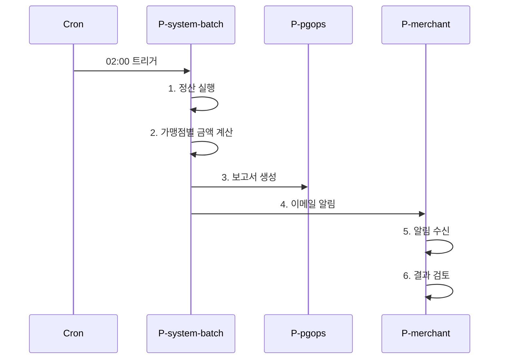

# Phase 3: Domain Storytelling

도메인 전문가의 입을 통한 워크플로우 캡처. Stefan Hofer의 Domain Storytelling 표기법을 사용한다.

**핵심:** "누가(Actor) 무엇을(Activity) 누구에게(Work Object) 어떻게 한다."

---

## 1. Prerequisites

- Phase 2 완료, candidate-inventory.md 존재.
- ontology-state.md `current_phase: 03-storytelling`.
- personas-seed.md 존재.

---

## 2. Question file

**파일:** `<workspace>/ontology-docs/03-storytelling/storytelling-questions.md`

```markdown
# Phase 3: Domain Storytelling Questions

> 이 단계는 자유 서술이 많습니다. 부담 갖지 마시고 떠오르는 대로 적어주세요.
> Phase 4, 5에서 정형화, 정련됩니다.
> 답변 후 "done"이라고 알려주세요.

## Question 1
가장 핵심적인 시나리오 **3개**를 자유롭게 서술해주세요.
시간 순서대로 "누가 무엇을 어떻게 한다" 형식이면 좋습니다.
시나리오마다 ### 헤더를 두고 적어주세요.

(예시)
### 시나리오 1: 일일 정산 배치
PG 운영팀은 매일 새벽 2시에 정산 배치를 실행한다.
배치는 어제 발생한 모든 결제 거래를 모아 가맹점별로 정산 금액을 계산한다.
계산이 끝나면 정산 결과 보고서가 생성되고 가맹점주에게 알림이 발송된다.

[Answer]:


## Question 2
각 시나리오의 **시작 트리거**는 무엇입니까?

### 시나리오 1 트리거
(예: "매일 02:00 cron", "사용자 정산 요청 클릭", "외부 결제 알림 수신")

[Answer]:

### 시나리오 2 트리거
[Answer]:

### 시나리오 3 트리거
[Answer]:


## Question 3
각 시나리오의 **성공 종료 조건**은 무엇입니까?

### 시나리오 1 종료
[Answer]:

### 시나리오 2 종료
[Answer]:

### 시나리오 3 종료
[Answer]:


## Question 4
시나리오 안에서 **등장하는 모든 사람, 시스템, 외부서비스**를 알려주세요.
Phase 1에서 적은 시드 페르소나에 추가, 수정해도 좋습니다.

(예: "PG 운영팀, 가맹점주, 자동 정산 배치, 결제 게이트웨이 외부 API, 이메일 알림 서비스")

[Answer]:


## Question 5
**예외, 실패 경로**가 있나요?

A. 있음: 시나리오별로 서술
B. 나중에 (Phase 4에서 다룸)
C. 해당 없음
D. Other (please describe after [Answer]: tag below)

[Answer]:

(A 선택 시 시나리오별 예외:)

### 시나리오 1 예외
[Answer]:

### 시나리오 2 예외
[Answer]:

### 시나리오 3 예외
[Answer]:
```

작성 후 사용자 알림. ontology-state.md 갱신:
- `current_step: awaiting-answers`
- `awaiting_input_file: ontology-docs/03-storytelling/storytelling-questions.md`

---

## 3. Validation

### 3.1 단순 검증
- Q1 시나리오 3개 미만이면 사용자에게 "더 적으실 수 있나요? 아니면 3개 미만으로 진행할까요?"
- Q4 페르소나가 personas-seed와 매우 다르면 (시드의 50% 이상 누락) → "시드 페르소나가 더 이상 관련 없는 것 같은데 맞나요?"

### 3.2 모순 검증
- Q1 시나리오에 등장한 actor가 Q4 목록에 없으면 → 명확화.
- Q1에 등장한 work object가 Phase 1 out-of-scope에 있으면 → 명확화.
- Q1에서 동일 시나리오에 Phase 2 candidate-inventory 엔티티가 전혀 등장 안 하면 → "이 시나리오는 Phase 2 자료원과 관계가 있나요?" 확인.

---

## 4. Artifacts

### 4.1 자동 변환

호스트 에이전트는 Q1 시나리오 자유 텍스트를 Domain Storytelling 표기로 변환:

1. **Actor 추출**: 시나리오 안의 사람, 시스템 명사. Q4에서 알려준 것 + 추가 발견.
2. **Activity 추출**: 동사. 시퀀스 번호 부여.
3. **Work Object 추출**: 동사의 대상 명사. Phase 2 candidate-inventory와 매칭 시도(이름 유사도).

### 4.2 `03-storytelling/personas.md`

`persona-tracking.md` §2 형식:

```markdown
# Personas

## P-pgops
- **이름:** PG 운영팀
- **역할:** 정산 처리, 이슈 대응. 일일 배치 모니터링.
- **목표:** 정확한 정산 처리, 오류 빠른 감지, 복구
- **관여 시나리오:** [story-001, story-003]
- **외부/내부:** 내부 (PG사 직원)
- **trace_links:**
  - phase 1 (seed): personas-seed.md (P-seed-2)
  - phase 3: this file
- **노트:** Phase 1 시드 P-seed-2와 동일.

## P-merchant
- ...
```

P-seed-* → 안정 ID 매핑은 audit.md에 기록.

### 4.3 `03-storytelling/stories/story-001-daily-settlement.md`

```markdown
# Story 001: Daily Settlement

**Trace ID:** story-001
**시나리오 출처:** Q1 시나리오 1

## Trigger
매일 02:00 cron (자동)

## Actors
- P-system-batch (자동 정산 배치)
- P-pgops (모니터링)
- P-merchant (결과 수신자)

## Activity Flow

1. **P-system-batch** → execute → `정산 실행 명령` (work object: cand-Settlement)
2. **P-system-batch** → calculate → `가맹점별 정산 금액` (work object: cand-Settlement)
3. **P-system-batch** → generate → `정산 결과 보고서` (work object: WO-settlement-report)
4. **P-system-batch** → send → `이메일 알림` (work object: WO-notification)
5. **P-merchant** → receive → `이메일 알림`
6. **P-merchant** → review → `정산 결과 보고서`

## Mermaid (시각 보조)



## Success End
- 정산 결과 보고서 생성됨
- 가맹점 알림 발송됨
- P-pgops가 보고서 검토 완료

## Exception Paths (Q5 응답)
- **부분 실패:** 일부 가맹점 정산 실패 시 P-pgops에게 알림 후 수동 재시도.
- **전체 실패:** 배치 자체 실패 시 P-pgops 즉시 호출. 다음날까지 재시도.

## Trace Links
- candidate-inventory (Phase 2): cand-Settlement, cand-Merchant
- glossary entries created: 정산, 정산 보고서, 가맹점

## Hotspots / Open Questions
- "정산 금액 계산 시 환불 거래는 포함되나?": Phase 4에서 결정.
```

각 시나리오마다 별도 파일. 시나리오 제목은 영문 kebab-slug.

### 4.4 `03-storytelling/glossary.md`

```markdown
# Glossary (Ubiquitous Language Seed)

> 도메인 용어집. Phase 4, 5에서 누적, 정련됩니다.

## 정산 (Settlement)
- **정의:** 한 정산 주기(일/주/월) 동안 발생한 결제 거래를 가맹점별로 합산해 입금 처리하는 프로세스.
- **출처:** story-001, candidate-inventory.md
- **동의어:** Settlement (영문)
- **혼동 주의:** "정산"이 가맹점-PG 간 정산을 가리키는 컨텍스트(Settlement Context)와 PG-카드사 간 정산을 가리키는 컨텍스트가 있을 수 있음 → Phase 4에서 분리.

## 가맹점주
- **정의:** PG와 계약을 맺고 결제 수단을 사용하는 사업자.
- **출처:** Q4, story-001, story-003
- **동의어:** Merchant (영문)

## 정산 결과 보고서
- **정의:** 정산 처리 후 가맹점주에게 제공되는 거래 내역, 정산 금액, 차감 내역 문서.
- **출처:** story-001
- **출력 형식:** PDF, 이메일 첨부 (Phase 5에서 결정)
```

### 4.5 `03-storytelling/viz/story-flow.json`

Cytoscape JSON.

```json
{
  "metadata": {
    "phase": "03-storytelling",
    "rendered_at": "...",
    "personas_index": ["P-system-batch", "P-pgops", "P-merchant"],
    "available_filters": ["persona", "story", "trace_link"],
    "available_layouts": ["fcose", "breadthfirst"]
  },
  "elements": {
    "nodes": [
      {
        "data": {
          "id": "P-system-batch",
          "label": "자동 정산 배치",
          "type": "persona",
          "trace_links": ["story-001"],
          "phase_introduced": "01"
        },
        "classes": "persona"
      },
      {
        "data": {
          "id": "Act-S1-A1",
          "label": "1. 정산 실행",
          "type": "activity",
          "story": "story-001",
          "personas": ["P-system-batch"],
          "trace_links": ["story-001"],
          "phase_introduced": "03"
        },
        "classes": "activity"
      },
      {
        "data": {
          "id": "WO-settlement-report",
          "label": "정산 결과 보고서",
          "type": "work-object",
          "trace_links": ["story-001"],
          "phase_introduced": "03"
        },
        "classes": "work-object"
      }
    ],
    "edges": [
      {
        "data": {
          "id": "e-S1-A1",
          "source": "P-system-batch",
          "target": "Act-S1-A1",
          "type": "actor-event",
          "label": "performs"
        }
      },
      {
        "data": {
          "id": "e-S1-A1-WO",
          "source": "Act-S1-A1",
          "target": "WO-settlement-report",
          "type": "related-to",
          "label": "produces"
        }
      }
    ]
  }
}
```

### 4.6 viz-runtime/current.json + persona-index.json + trace-links.json
호스트 에이전트가 통합 갱신. 페르소나 필터가 실제 작동하도록 persona-index.json에 카드 정보 포함.

---

## 5. Visualization

자동 시작/갱신. 페르소나 필터 1급. 사용자에게 안내:

```
Phase 3 시각화: {viz_url}

좌측 페르소나 필터에서 한 페르소나를 클릭하면, 그 페르소나가 등장하는 활동, 작업대상만 강조됩니다.
시퀀스 번호가 활동에 표시됩니다(예: "1. 정산 실행").
```

---

## 6. Gate

```
확인: Phase 3: Domain Storytelling 완료.

산출물:
- ontology-docs/03-storytelling/personas.md ({N}명)
- ontology-docs/03-storytelling/stories/ ({N}개 시나리오)
- ontology-docs/03-storytelling/glossary.md ({N}개 용어)
- ontology-docs/03-storytelling/viz/story-flow.json

시각화: {viz_url}

검증 우선순위:
- 반드시: 페르소나 이름, 역할 (이후 phase에서 ID 변경 어렵습니다)
- 권장: 시나리오 누락 검토, glossary 용어 정확성

다음 중 선택해주세요:
1. Continue: Phase 4 (Event Storming)
2. Request Changes: 시나리오, 페르소나 수정
3. Add another story: 시나리오 추가
4. Re-visualize: 다른 레이아웃, 페르소나 필터로
```

---

## 7. 응답 처리

- **Continue** → Phase 4 진입.
- **Request Changes** → 수정 요청 → 산출물 갱신 → 다시 게이트.
- **Add another story** → Q1에 시나리오 추가 받기 → story-NNN 추가 작성 → personas/glossary 갱신 → viz reload → 다시 게이트.
- **Re-visualize** → viz 옵션 변경.
